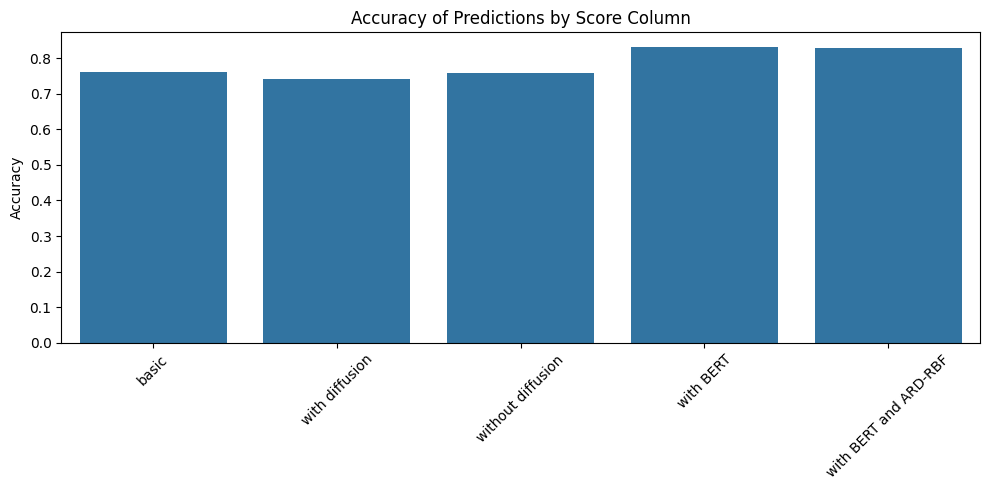
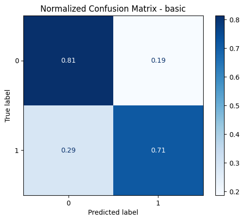
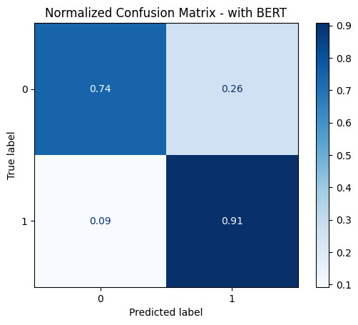
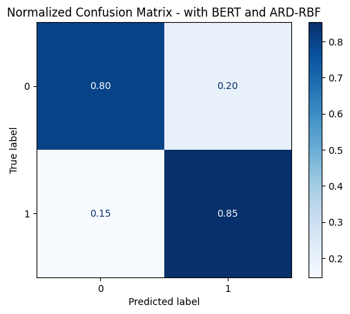
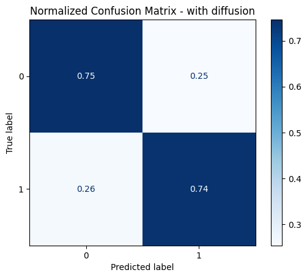
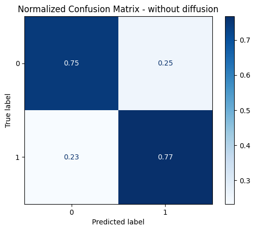

# Bayesian Surrogate Modelling for LLM-Generated Text Detection

## Abstract
This repository presents the implementation of a Bayesian surrogate modeling approach for detecting machine-generated text, originally developed as a course project. The rapid advancement and proliferation of Large Language Models (LLMs) necessitate robust detection mechanisms to mitigate potential misuse. Building upon the zero-shot baseline method, DetectGPT, this work investigates efficiency and accuracy enhancements via a Bayesian Surrogate Model. Specifically, we introduce a diffusion-based perturbation mechanism to generate more informative candidate texts and reformulate the kernel function of the Bayesian surrogate model to better capture the underlying semantic landscape.

## Methodology

The proposed methodology builds upon the DetectGPT framework, integrating a diffusion-inspired perturbation generator and a modified kernel for the surrogate model. A Gaussian Process (GP) serves as the surrogate model, tasked with two primary objectives: (i) approximating the log-probability function and (ii) sequentially identifying maximally informative perturbations for LLM querying.

### Baseline: DetectGPT
DetectGPT identifies machine-generated text by analyzing the log-probability curvature of a candidate passage under minor semantic perturbations. It utilizes the following discrepancy measure to determine if a text passage $x$ is generated by an LLM $p_\theta$:

$$ \log p_\theta(x) - \mathbb{E}_{\tilde{x} \sim q(\cdot|x)} [\log p_\theta(\tilde{x})] $$

For a given input text, a paraphrasing model generates a set of semantically similar perturbations. The normalized log-probabilities of each token are subsequently computed using a source language model. The detection score is defined as the difference between the log-probability of the original text and the expected log-probability of its perturbed neighborhood.

### Bayesian Surrogate Model
To efficiently interpolate the log-probability distribution over the perturbation space, a Bayesian surrogate model, specifically Gaussian Process Regression, is employed:

$$ f \sim GP(0, k(\cdot, \cdot)) $$

Deviating from standard kernels, a custom similarity measure based on **BERTScore** is implemented to capture the semantic relationships between candidate texts:

$$ k(x_i, x_j) = \alpha \cdot S_{ij} + \beta $$

where $S_{ij}$ denotes the semantic similarity computed via BERTScore, and $\alpha, \beta$ are optimizable hyperparameters.

Active sampling is guided by the uncertainty estimates derived from the GP. At each iteration, the candidate exhibiting the highest predictive variance is selected for querying until a predefined convergence threshold is achieved.

### Proposed Methodological Enhancements

#### 1. Diffusion-Based Perturbation
To generate semantically rich and structurally diverse perturbations, a diffusion-inspired refinement pipeline is introduced:
1.  **Noising**: The initial text is paraphrased (e.g., utilizing a ChatGPT-based paraphraser) to introduce controlled semantic variance.
2.  **Denoising/Refinement**: The noised text is subsequently processed by a text-to-text generation model (e.g., flan-t5-small) to reconstruct a refined, structurally coherent variation.

#### 2. Hybrid BERTScore and ARD-RBF Kernel
To simultaneously capture high-level semantic equivalency and fine-grained geometric relationships in the latent space, a composite kernel is formulated:

$$ k(x, x') = \alpha \cdot k_{\text{BERTScore}}(x, x') + \beta \cdot k_{\text{ARD-RBF}}(\phi(x), \phi(x')) $$

where $\phi(x)$ denotes the mean-pooled BERT embedding of the text, and $k_{\text{ARD-RBF}}$ represents an Automatic Relevance Determination (ARD) variant of the standard RBF kernel:

$$ k_{\text{ARD-RBF}}(\phi(x), \phi(x')) = \exp \left( - \frac{1}{2} \sum_{j=1}^{d} \frac{(\phi(x)_j - \phi(x')_j)^2}{\ell_j^2} \right) $$

## Experimental Setup and Results

### Dataset
Empirical evaluations were conducted on a subset of the **LLM-Human Classification Data** corpus. To ensure computational tractability while maintaining class balance, the evaluation set comprised 581 LLM-generated and 525 human-written samples, yielding a total of 1,106 passages.

### Results
The evaluation primarily investigates the comparative impact of the proposed perturbation and kernel strategies on classification accuracy.

*   **Baseline / Without diffusion**: The standard DetectGPT approach yielded classification accuracies of approximately 76%.
*   **With diffusion**: The introduction of diffusion-inspired perturbations resulted in a marginal reduction in accuracy, suggesting that the introduced variance may not strictly align with the informative directions of the log-probability landscape.
*   **With BERT (BERTScore kernel)**: The integration of the BERTScore kernel yielded a marked improvement, elevating accuracy to over 82%.
*   **With BERT and ARD-RBF**: The hybrid kernel demonstrated comparable performance, indicating that the primary performance gains originate from the semantic similarity component.

### Confusion Matrices

To provide a granular analysis of the classification behavior, normalized confusion matrices for five distinct configurations are presented:

| Basic | With BERT | With BERT and ARD-RBF |
|:---:|:---:|:---:|
|  |  |  |
| True positive rates: 81% (human), 71% (machine) | Machine text detection significantly improved to 91% TPR. | Balanced performance: 80% (human), 85% (machine). |

| With Diffusion | Without Diffusion |
|:---:|:---:|
|  |  |
| Demonstrates balanced but marginally lower overall performance. | Yields a slight improvement in machine text detection relative to the diffusion approach. |

### Computational Efficiency
While the BERT-based surrogate enhancements confer substantial improvements in detection accuracy, they necessitate increased computational expenditure (approximately 22-24 seconds per sample) relative to the baseline methodology (5.6 seconds), predominantly due to the overhead of semantic similarity computations.

## Conclusion
This investigation underscores the efficacy of integrating semantic similarity measures (e.g., BERTScore) into the kernel design of Bayesian surrogate models for text detection. Furthermore, it demonstrates that active sampling and kernel optimization can yield significant performance gains under constrained query budgets. While the diffusion-inspired perturbation mechanism exhibited mixed efficacy, it highlights a promising architectural direction for future refinement.
